# Studio Signal Flow Diagrams

Visual reference for all signal paths in the studio. Rendered with Mermaid.

---

## Studio Overview

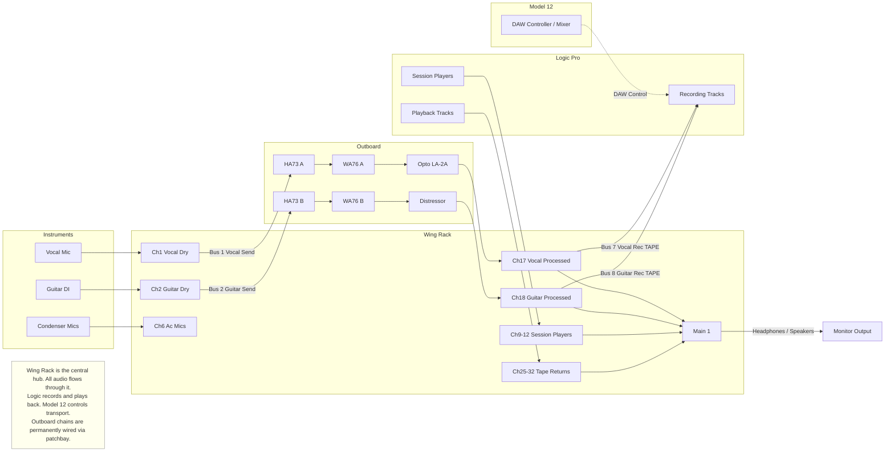
```mermaid
graph LR
    subgraph Instruments
        MIC[Vocal Mic]
        DI[Guitar DI]
        COND[Condenser Mics]
    end

    subgraph Wing Rack
        CH1[Ch1 Vocal Dry]
        CH2[Ch2 Guitar Dry]
        CH6[Ch6 Ac Mics]
        CH17[Ch17 Vocal Processed]
        CH18[Ch18 Guitar Processed]
        CH9[Ch9-12 Session Players]
        CH25[Ch25-32 Tape Returns]
        MAIN[Main 1]
    end

    subgraph Outboard
        HA73A[HA73 A]
        WA76A[WA76 A]
        OPTO[Opto LA-2A]
        HA73B[HA73 B]
        WA76B[WA76 B]
        DIST[Distressor]
    end

    subgraph Logic Pro
        REC[Recording Tracks]
        SP[Session Players]
        PLAY[Playback Tracks]
    end

    subgraph Model 12
        M12[DAW Controller / Mixer]
    end

    MIC --> CH1
    DI --> CH2
    COND --> CH6

    CH1 -->|Bus 1 Vocal Send| HA73A --> WA76A --> OPTO --> CH17
    CH2 -->|Bus 2 Guitar Send| HA73B --> WA76B --> DIST --> CH18

    CH17 -->|Bus 7 Vocal Rec TAPE| REC
    CH18 -->|Bus 8 Guitar Rec TAPE| REC

    SP --> CH9
    PLAY --> CH25

    CH17 --> MAIN
    CH18 --> MAIN
    CH9 --> MAIN
    CH25 --> MAIN
    MAIN -->|Headphones / Speakers| OUT[Monitor Output]

    M12 -.->|DAW Control| REC

    NOTE[Wing Rack is the central hub. All audio flows through it.<br/>Logic records and plays back. Model 12 controls transport.<br/>Outboard chains are permanently wired via patchbay.]

    style NOTE fill:#ffe,stroke:#999
```

---

## Vocal Signal Chain

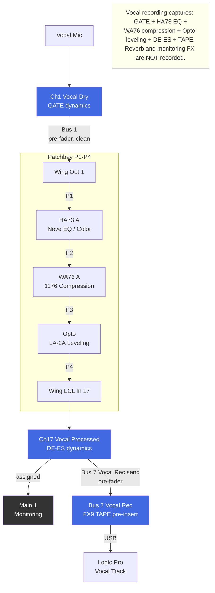
```mermaid
graph TD
    MIC[Vocal Mic] --> CH1[Ch1 Vocal Dry<br/>GATE dynamics]

    CH1 -->|Bus 1<br/>pre-fader, clean| OUT1[Wing Out 1]

    subgraph Patchbay P1-P4
        OUT1 -->|P1| HA73A[HA73 A<br/>Neve EQ / Color]
        HA73A -->|P2| WA76A[WA76 A<br/>1176 Compression]
        WA76A -->|P3| OPTO[Opto<br/>LA-2A Leveling]
        OPTO -->|P4| LCL17[Wing LCL In 17]
    end

    LCL17 --> CH17[Ch17 Vocal Processed<br/>DE-ES dynamics]

    CH17 -->|assigned| MAIN[Main 1<br/>Monitoring]
    CH17 -->|Bus 7 Vocal Rec send<br/>pre-fader| BUS7[Bus 7 Vocal Rec<br/>FX9 TAPE pre-insert]

    BUS7 -->|USB| LOGIC[Logic Pro<br/>Vocal Track]

    NOTE[Vocal recording captures: GATE + HA73 EQ +<br/>WA76 compression + Opto leveling + DE-ES + TAPE.<br/>Reverb and monitoring FX are NOT recorded.]

    style CH1 fill:#4169E1,color:#fff
    style CH17 fill:#4169E1,color:#fff
    style BUS7 fill:#4169E1,color:#fff
    style MAIN fill:#333,color:#fff
    style NOTE fill:#ffe,stroke:#999
```

---

## Guitar Signal Chain

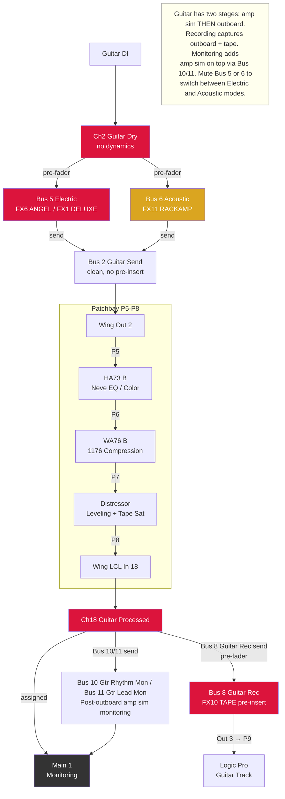
```mermaid
graph TD
    DI[Guitar DI] --> CH2[Ch2 Guitar Dry<br/>no dynamics]

    CH2 -->|pre-fader| BUS5[Bus 5 Electric<br/>FX6 ANGEL / FX1 DELUXE]
    CH2 -->|pre-fader| BUS6[Bus 6 Acoustic<br/>FX11 RACKAMP]

    BUS5 -->|send| BUS2[Bus 2 Guitar Send<br/>clean, no pre-insert]
    BUS6 -->|send| BUS2

    BUS2 --> OUT2[Wing Out 2]

    subgraph Patchbay P5-P8
        OUT2 -->|P5| HA73B[HA73 B<br/>Neve EQ / Color]
        HA73B -->|P6| WA76B[WA76 B<br/>1176 Compression]
        WA76B -->|P7| DIST[Distressor<br/>Leveling + Tape Sat]
        DIST -->|P8| LCL18[Wing LCL In 18]
    end

    LCL18 --> CH18[Ch18 Guitar Processed]

    CH18 -->|assigned| MAIN[Main 1<br/>Monitoring]
    CH18 -->|Bus 10/11 send| MON[Bus 10 Gtr Rhythm Mon / Bus 11 Gtr Lead Mon<br/>Post-outboard amp sim monitoring]
    CH18 -->|Bus 8 Guitar Rec send<br/>pre-fader| BUS8[Bus 8 Guitar Rec<br/>FX10 TAPE pre-insert]

    MON --> MAIN
    BUS8 -->|Out 3 → P9| LOGIC[Logic Pro<br/>Guitar Track]

    NOTE[Guitar has two stages: amp sim THEN outboard.<br/>Recording captures outboard + tape. Monitoring adds<br/>amp sim on top via Bus 10/11. Mute Bus 5 or 6 to<br/>switch between Electric and Acoustic modes.]

    style CH2 fill:#DC143C,color:#fff
    style CH18 fill:#DC143C,color:#fff
    style BUS8 fill:#DC143C,color:#fff
    style BUS5 fill:#DC143C,color:#fff
    style BUS6 fill:#DAA520,color:#fff
    style MAIN fill:#333,color:#fff
    style NOTE fill:#ffe,stroke:#999
```

---

## Recording vs Monitoring — Separate Paths

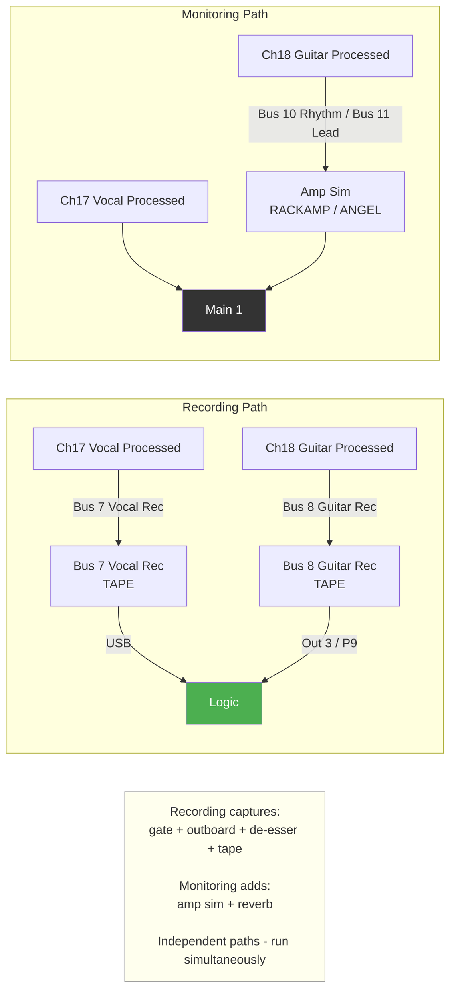
```mermaid
graph LR
    subgraph Recording Path
        direction TB
        CH17R[Ch17 Vocal Processed] -->|Bus 7 Vocal Rec| BUS7[Bus 7 Vocal Rec<br/>TAPE] -->|USB| LOGIC_R[Logic]
        CH18R[Ch18 Guitar Processed] -->|Bus 8 Guitar Rec| BUS8[Bus 8 Guitar Rec<br/>TAPE] -->|Out 3 / P9| LOGIC_R
    end

    subgraph Monitoring Path
        direction TB
        CH17M[Ch17 Vocal Processed] --> MAIN[Main 1]
        CH18M[Ch18 Guitar Processed] -->|Bus 10 Rhythm / Bus 11 Lead| AMP[Amp Sim<br/>RACKAMP / ANGEL] --> MAIN
    end

    REC_NOTE[Recording captures:<br/>gate + outboard + de-esser + tape<br/><br/>Monitoring adds:<br/>amp sim + reverb<br/><br/>Independent paths - run simultaneously]

    style REC_NOTE fill:#ffe,stroke:#999
    style LOGIC_R fill:#4CAF50,color:#fff
    style MAIN fill:#333,color:#fff
```

---

## Tape Returns — Logic Playback Through Wing

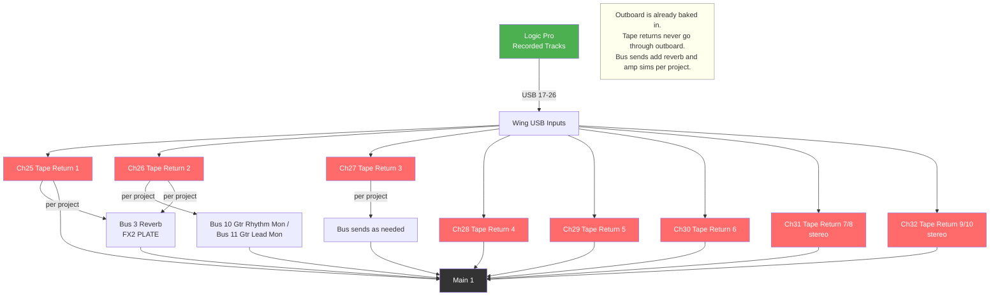
```mermaid
graph TD
    LOGIC[Logic Pro<br/>Recorded Tracks] -->|USB 17-26| WING[Wing USB Inputs]

    WING --> CH25[Ch25 Tape Return 1]
    WING --> CH26[Ch26 Tape Return 2]
    WING --> CH27[Ch27 Tape Return 3]
    WING --> CH28[Ch28 Tape Return 4]
    WING --> CH29[Ch29 Tape Return 5]
    WING --> CH30[Ch30 Tape Return 6]
    WING --> CH31[Ch31 Tape Return 7/8<br/>stereo]
    WING --> CH32[Ch32 Tape Return 9/10<br/>stereo]

    CH25 -->|per project| BUS3[Bus 3 Reverb<br/>FX2 PLATE]
    CH26 -->|per project| BUS10[Bus 10 Gtr Rhythm Mon /<br/>Bus 11 Gtr Lead Mon]
    CH26 -->|per project| BUS3
    CH27 -->|per project| SENDS[Bus sends as needed]

    BUS3 --> MAIN[Main 1]
    BUS10 --> MAIN
    SENDS --> MAIN

    CH25 --> MAIN
    CH28 --> MAIN
    CH29 --> MAIN
    CH30 --> MAIN
    CH31 --> MAIN
    CH32 --> MAIN

    NOTE[Outboard is already baked in.<br/>Tape returns never go through outboard.<br/>Bus sends add reverb and amp sims per project.]

    style LOGIC fill:#4CAF50,color:#fff
    style MAIN fill:#333,color:#fff
    style NOTE fill:#ffe,stroke:#999
    style CH25 fill:#FF6B6B,color:#fff
    style CH26 fill:#FF6B6B,color:#fff
    style CH27 fill:#FF6B6B,color:#fff
    style CH28 fill:#FF6B6B,color:#fff
    style CH29 fill:#FF6B6B,color:#fff
    style CH30 fill:#FF6B6B,color:#fff
    style CH31 fill:#FF6B6B,color:#fff
    style CH32 fill:#FF6B6B,color:#fff
```

---

## Patchbay Layout

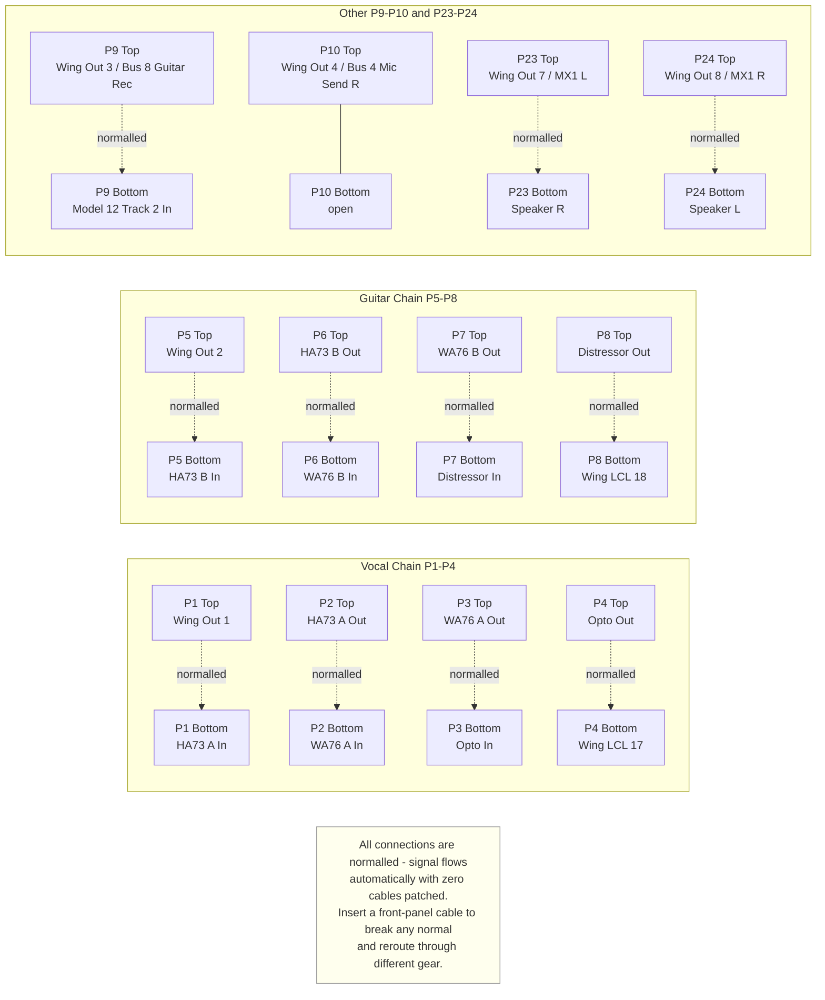
```mermaid
graph LR
    subgraph Vocal Chain P1-P4
        P1T[P1 Top<br/>Wing Out 1] -.->|normalled| P1B[P1 Bottom<br/>HA73 A In]
        P2T[P2 Top<br/>HA73 A Out] -.->|normalled| P2B[P2 Bottom<br/>WA76 A In]
        P3T[P3 Top<br/>WA76 A Out] -.->|normalled| P3B[P3 Bottom<br/>Opto In]
        P4T[P4 Top<br/>Opto Out] -.->|normalled| P4B[P4 Bottom<br/>Wing LCL 17]
    end

    subgraph Guitar Chain P5-P8
        P5T[P5 Top<br/>Wing Out 2] -.->|normalled| P5B[P5 Bottom<br/>HA73 B In]
        P6T[P6 Top<br/>HA73 B Out] -.->|normalled| P6B[P6 Bottom<br/>WA76 B In]
        P7T[P7 Top<br/>WA76 B Out] -.->|normalled| P7B[P7 Bottom<br/>Distressor In]
        P8T[P8 Top<br/>Distressor Out] -.->|normalled| P8B[P8 Bottom<br/>Wing LCL 18]
    end

    subgraph Other P9-P10 and P23-P24
        P9T[P9 Top<br/>Wing Out 3 / Bus 8 Guitar Rec] -.->|normalled| P9B[P9 Bottom<br/>Model 12 Track 2 In]
        P10T[P10 Top<br/>Wing Out 4 / Bus 4 Mic Send R] --- P10B[P10 Bottom<br/>open]
        P23T[P23 Top<br/>Wing Out 7 / MX1 L] -.->|normalled| P23B[P23 Bottom<br/>Speaker R]
        P24T[P24 Top<br/>Wing Out 8 / MX1 R] -.->|normalled| P24B[P24 Bottom<br/>Speaker L]
    end

    NOTE[All connections are normalled - signal flows<br/>automatically with zero cables patched.<br/>Insert a front-panel cable to break any normal<br/>and reroute through different gear.]

    style NOTE fill:#ffe,stroke:#999
```

---

## Bus Architecture

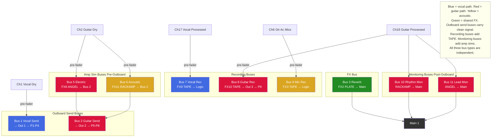
```mermaid
graph TD
    subgraph Outboard Send Buses
        BUS1[Bus 1 Vocal Send<br/>→ Out 1 → P1-P4]
        BUS2[Bus 2 Guitar Send<br/>→ Out 2 → P5-P8]
    end

    subgraph Amp Sim Buses Pre-Outboard
        BUS5[Bus 5 Electric<br/>FX6 ANGEL → Bus 2]
        BUS6[Bus 6 Acoustic<br/>FX11 RACKAMP → Bus 2]
    end

    subgraph Recording Buses
        BUS7[Bus 7 Vocal Rec<br/>FX9 TAPE → Logic]
        BUS8[Bus 8 Guitar Rec<br/>FX10 TAPE → Out 3 → P9]
        BUS9[Bus 9 Mic Rec<br/>FX3 TAPE → Logic]
    end

    subgraph Monitoring Buses Post-Outboard
        BUS10[Bus 10 Rhythm Mon<br/>RACKAMP → Main]
        BUS11[Bus 11 Lead Mon<br/>ANGEL → Main]
    end

    subgraph FX Bus
        BUS3[Bus 3 Reverb<br/>FX2 PLATE → Main]
    end

    CH1[Ch1 Vocal Dry] -->|pre-fader| BUS1
    CH2[Ch2 Guitar Dry] -->|pre-fader| BUS5
    CH2 -->|pre-fader| BUS6
    BUS5 --> BUS2
    BUS6 --> BUS2

    CH17[Ch17 Vocal Processed] -->|pre-fader| BUS7
    CH18[Ch18 Guitar Processed] -->|pre-fader| BUS8
    CH18 --> BUS10
    CH18 --> BUS11
    CH6[Ch6 Gtr Ac Mics] -->|pre-fader| BUS9

    BUS3 --> MAIN[Main 1]
    BUS10 --> MAIN
    BUS11 --> MAIN

    NOTE[Blue = vocal path. Red = guitar path. Yellow = acoustic.<br/>Green = shared FX. Outboard send buses carry clean signal.<br/>Recording buses add TAPE. Monitoring buses add amp sims.<br/>All three bus types are independent.]

    style BUS1 fill:#4169E1,color:#fff
    style BUS2 fill:#DC143C,color:#fff
    style BUS5 fill:#DC143C,color:#fff
    style BUS6 fill:#DAA520,color:#fff
    style BUS7 fill:#4169E1,color:#fff
    style BUS8 fill:#DC143C,color:#fff
    style BUS9 fill:#DAA520,color:#fff
    style BUS10 fill:#DC143C,color:#fff
    style BUS11 fill:#DC143C,color:#fff
    style BUS3 fill:#228B22,color:#fff
    style MAIN fill:#333,color:#fff
    style NOTE fill:#ffe,stroke:#999
```

---

## USB / Loopback Routing

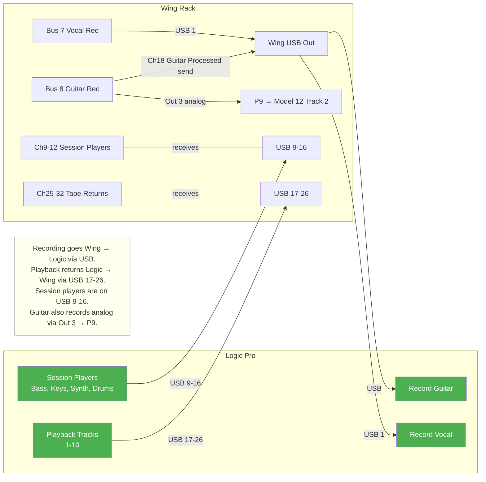
```mermaid
graph LR
    subgraph Wing Rack
        BUS7[Bus 7 Vocal Rec] -->|USB 1| USB_OUT[Wing USB Out]
        BUS8[Bus 8 Guitar Rec] -->|Out 3 analog| P9[P9 → Model 12 Track 2]
        BUS8 -->|Ch18 Guitar Processed send| USB_OUT
        CH9[Ch9-12 Session Players] ---|receives| USB_IN_SP[USB 9-16]
        CH25[Ch25-32 Tape Returns] ---|receives| USB_IN_TR[USB 17-26]
    end

    subgraph Logic Pro
        REC_V[Record Vocal]
        REC_G[Record Guitar]
        SESSION[Session Players<br/>Bass, Keys, Synth, Drums]
        PLAYBACK[Playback Tracks<br/>1-10]
    end

    USB_OUT -->|USB 1| REC_V
    USB_OUT -->|USB| REC_G
    SESSION -->|USB 9-16| USB_IN_SP
    PLAYBACK -->|USB 17-26| USB_IN_TR

    NOTE[Recording goes Wing → Logic via USB.<br/>Playback returns Logic → Wing via USB 17-26.<br/>Session players are on USB 9-16.<br/>Guitar also records analog via Out 3 → P9.]

    style REC_V fill:#4CAF50,color:#fff
    style REC_G fill:#4CAF50,color:#fff
    style SESSION fill:#4CAF50,color:#fff
    style PLAYBACK fill:#4CAF50,color:#fff
    style NOTE fill:#ffe,stroke:#999
```

---

## Re-amping Path

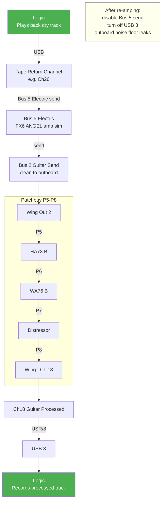
```mermaid
graph TD
    LOGIC[Logic<br/>Plays back dry track] -->|USB| TR[Tape Return Channel<br/>e.g. Ch26]

    TR -->|Bus 5 Electric send| BUS5[Bus 5 Electric<br/>FX6 ANGEL amp sim]

    BUS5 -->|send| BUS2[Bus 2 Guitar Send<br/>clean to outboard]
    BUS2 --> OUT2[Wing Out 2]

    subgraph Patchbay P5-P8
        OUT2 -->|P5| HA73B[HA73 B] -->|P6| WA76B[WA76 B] -->|P7| DIST[Distressor] -->|P8| LCL18[Wing LCL 18]
    end

    LCL18 --> CH18[Ch18 Guitar Processed]
    CH18 -->|USR/8| USB3[USB 3]
    USB3 --> LOGIC_REC[Logic<br/>Records processed track]

    NOTE[After re-amping:<br/>disable Bus 5 send<br/>turn off USB 3<br/>outboard noise floor leaks]

    style LOGIC fill:#4CAF50,color:#fff
    style LOGIC_REC fill:#4CAF50,color:#fff
    style NOTE fill:#ffe,stroke:#999
```

---

## Guitar Amp Sim Modes

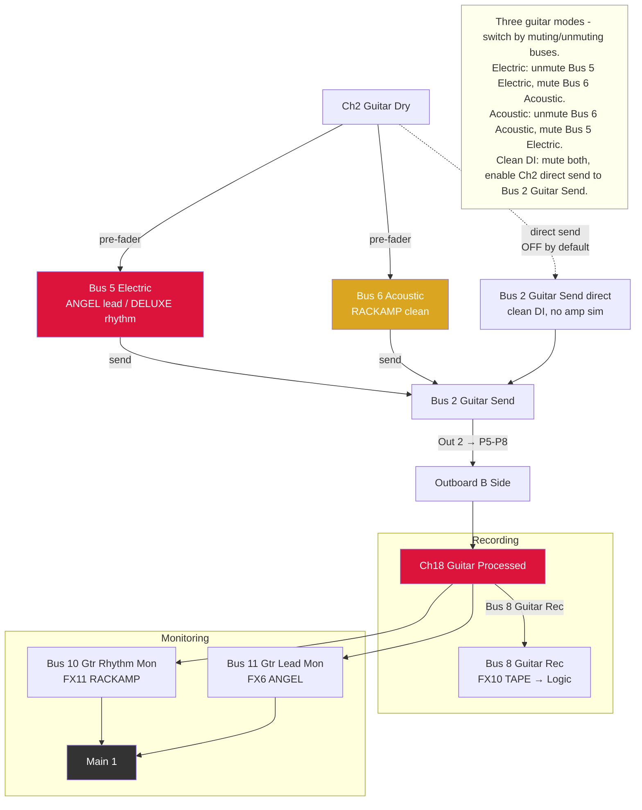
```mermaid
graph TD
    CH2[Ch2 Guitar Dry] -->|pre-fader| BUS5[Bus 5 Electric<br/>ANGEL lead / DELUXE rhythm]
    CH2 -->|pre-fader| BUS6[Bus 6 Acoustic<br/>RACKAMP clean]
    CH2 -.->|direct send<br/>OFF by default| BUS2_DIRECT[Bus 2 Guitar Send direct<br/>clean DI, no amp sim]

    BUS5 -->|send| BUS2[Bus 2 Guitar Send]
    BUS6 -->|send| BUS2
    BUS2_DIRECT --> BUS2

    BUS2 -->|Out 2 → P5-P8| OUTBOARD[Outboard B Side]

    OUTBOARD --> CH18[Ch18 Guitar Processed]

    CH18 --> BUS10[Bus 10 Gtr Rhythm Mon<br/>FX11 RACKAMP]
    CH18 --> BUS11[Bus 11 Gtr Lead Mon<br/>FX6 ANGEL]

    subgraph Recording
        CH18 -->|Bus 8 Guitar Rec| REC[Bus 8 Guitar Rec<br/>FX10 TAPE → Logic]
    end

    subgraph Monitoring
        BUS10 --> MAIN[Main 1]
        BUS11 --> MAIN
    end

    NOTE[Three guitar modes - switch by muting/unmuting buses.<br/>Electric: unmute Bus 5 Electric, mute Bus 6 Acoustic.<br/>Acoustic: unmute Bus 6 Acoustic, mute Bus 5 Electric.<br/>Clean DI: mute both, enable Ch2 direct send to Bus 2 Guitar Send.]

    style BUS5 fill:#DC143C,color:#fff
    style BUS6 fill:#DAA520,color:#fff
    style CH18 fill:#DC143C,color:#fff
    style MAIN fill:#333,color:#fff
    style NOTE fill:#ffe,stroke:#999
```

---

## What Gets Recorded vs What You Hear

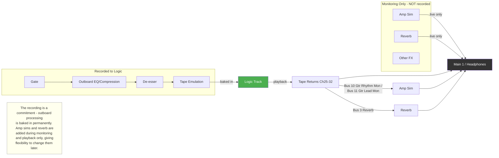
```mermaid
graph LR
    subgraph Recorded to Logic
        R1[Gate]
        R2[Outboard EQ/Compression]
        R3[De-esser]
        R4[Tape Emulation]
        R1 --> R2 --> R3 --> R4
    end

    subgraph Monitoring Only - NOT recorded
        M1[Amp Sim]
        M2[Reverb]
        M3[Other FX]
    end

    R4 -->|baked in| LOGIC[Logic Track]
    M1 -->|live only| MAIN[Main 1 / Headphones]
    M2 -->|live only| MAIN

    LOGIC -->|playback| TR[Tape Returns Ch25-32]
    TR -->|Bus 10 Gtr Rhythm Mon /<br/>Bus 11 Gtr Lead Mon| M1_PLAY[Amp Sim]
    TR -->|Bus 3 Reverb| M2_PLAY[Reverb]
    TR --> MAIN
    M1_PLAY --> MAIN
    M2_PLAY --> MAIN

    NOTE[The recording is a commitment - outboard processing<br/>is baked in permanently. Amp sims and reverb are<br/>added during monitoring and playback only, giving<br/>flexibility to change them later.]

    style LOGIC fill:#4CAF50,color:#fff
    style MAIN fill:#333,color:#fff
    style NOTE fill:#ffe,stroke:#999
```

---

## Noise Floor Troubleshooting

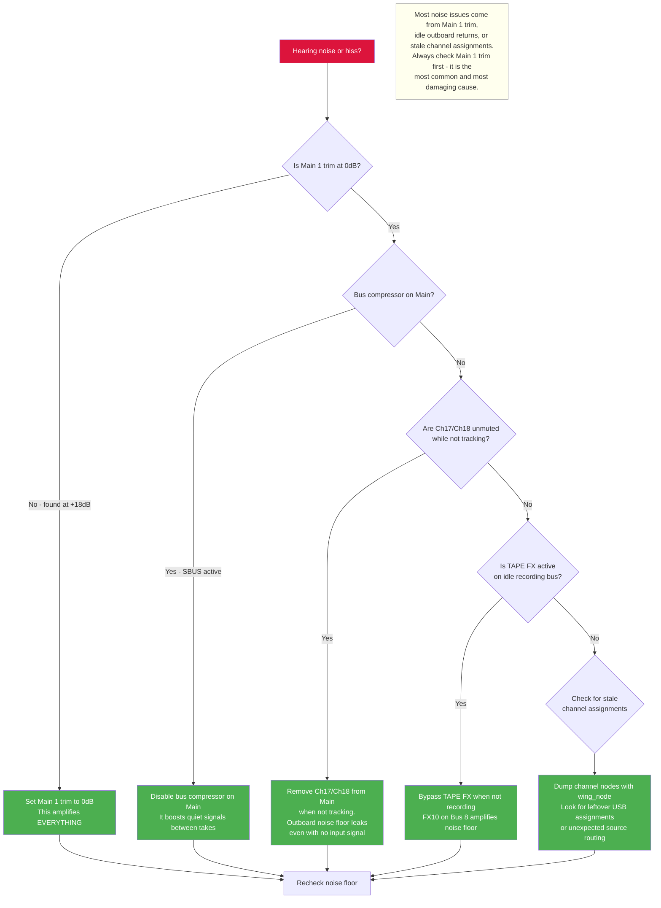
```mermaid
flowchart TD
    START[Hearing noise or hiss?] --> Q1{Is Main 1 trim at 0dB?}
    Q1 -->|No - found at +18dB| FIX1[Set Main 1 trim to 0dB<br/>This amplifies EVERYTHING]
    Q1 -->|Yes| Q2{Bus compressor on Main?}

    Q2 -->|Yes - SBUS active| FIX2[Disable bus compressor on Main<br/>It boosts quiet signals between takes]
    Q2 -->|No| Q3{Are Ch17/Ch18 unmuted<br/>while not tracking?}

    Q3 -->|Yes| FIX3[Remove Ch17/Ch18 from Main<br/>when not tracking.<br/>Outboard noise floor leaks<br/>even with no input signal]
    Q3 -->|No| Q4{Is TAPE FX active<br/>on idle recording bus?}

    Q4 -->|Yes| FIX4[Bypass TAPE FX when not recording<br/>FX10 on Bus 8 amplifies noise floor]
    Q4 -->|No| Q5{Check for stale<br/>channel assignments}

    Q5 --> FIX5[Dump channel nodes with wing_node<br/>Look for leftover USB assignments<br/>or unexpected source routing]

    FIX1 --> RECHECK[Recheck noise floor]
    FIX2 --> RECHECK
    FIX3 --> RECHECK
    FIX4 --> RECHECK
    FIX5 --> RECHECK

    NOTE[Most noise issues come from Main 1 trim,<br/>idle outboard returns, or stale channel assignments.<br/>Always check Main 1 trim first - it is the<br/>most common and most damaging cause.]

    style NOTE fill:#ffe,stroke:#999
    style START fill:#DC143C,color:#fff
    style FIX1 fill:#4CAF50,color:#fff
    style FIX2 fill:#4CAF50,color:#fff
    style FIX3 fill:#4CAF50,color:#fff
    style FIX4 fill:#4CAF50,color:#fff
    style FIX5 fill:#4CAF50,color:#fff
```

---

## Feedback Loop Troubleshooting

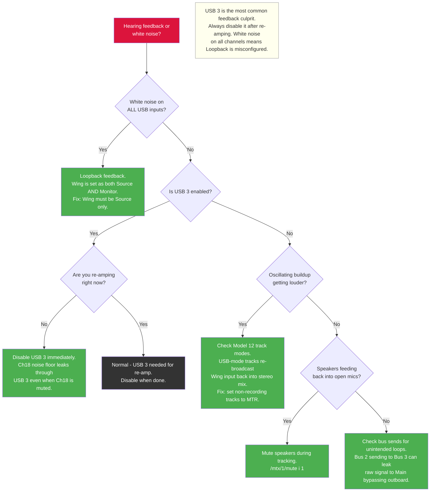
```mermaid
flowchart TD
    START[Hearing feedback or<br/>white noise?] --> Q1{White noise on<br/>ALL USB inputs?}

    Q1 -->|Yes| FIX1[Loopback feedback.<br/>Wing is set as both Source AND Monitor.<br/>Fix: Wing must be Source only.]
    Q1 -->|No| Q2{Is USB 3 enabled?}

    Q2 -->|Yes| Q3{Are you re-amping<br/>right now?}
    Q3 -->|No| FIX2[Disable USB 3 immediately.<br/>Ch18 noise floor leaks through<br/>USB 3 even when Ch18 is muted.]
    Q3 -->|Yes| OK1[Normal - USB 3 needed for re-amp.<br/>Disable when done.]

    Q2 -->|No| Q4{Oscillating buildup<br/>getting louder?}
    Q4 -->|Yes| FIX3[Check Model 12 track modes.<br/>USB-mode tracks re-broadcast<br/>Wing input back into stereo mix.<br/>Fix: set non-recording tracks to MTR.]
    Q4 -->|No| Q5{Speakers feeding<br/>back into open mics?}

    Q5 -->|Yes| FIX4[Mute speakers during tracking.<br/>/mtx/1/mute i 1]
    Q5 -->|No| FIX5[Check bus sends for unintended loops.<br/>Bus 2 sending to Bus 3 can leak<br/>raw signal to Main bypassing outboard.]

    NOTE[USB 3 is the most common feedback culprit.<br/>Always disable it after re-amping. White noise<br/>on all channels means Loopback is misconfigured.]

    style NOTE fill:#ffe,stroke:#999
    style START fill:#DC143C,color:#fff
    style FIX1 fill:#4CAF50,color:#fff
    style FIX2 fill:#4CAF50,color:#fff
    style FIX3 fill:#4CAF50,color:#fff
    style FIX4 fill:#4CAF50,color:#fff
    style FIX5 fill:#4CAF50,color:#fff
    style OK1 fill:#333,color:#fff
```

---

## FX Slot Collision Troubleshooting

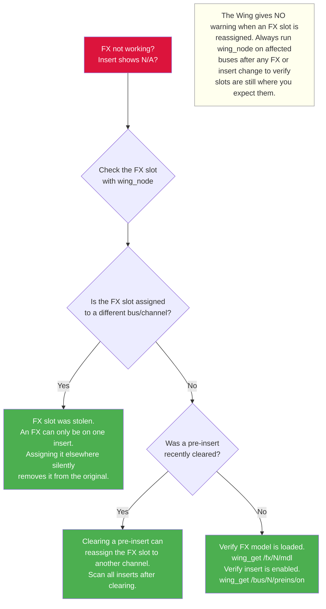
```mermaid
flowchart TD
    START[FX not working?<br/>Insert shows N/A?] --> Q1{Check the FX slot<br/>with wing_node}

    Q1 --> Q2{Is the FX slot assigned<br/>to a different bus/channel?}
    Q2 -->|Yes| FIX1[FX slot was stolen.<br/>An FX can only be on one insert.<br/>Assigning it elsewhere silently<br/>removes it from the original.]
    Q2 -->|No| Q3{Was a pre-insert<br/>recently cleared?}

    Q3 -->|Yes| FIX2[Clearing a pre-insert can<br/>reassign the FX slot to another channel.<br/>Scan all inserts after clearing.]
    Q3 -->|No| FIX3[Verify FX model is loaded.<br/>wing_get /fx/N/mdl<br/>Verify insert is enabled.<br/>wing_get /bus/N/preins/on]

    NOTE[The Wing gives NO warning when an FX slot is<br/>reassigned. Always run wing_node on affected<br/>buses after any FX or insert change to verify<br/>slots are still where you expect them.]

    style NOTE fill:#ffe,stroke:#999
    style START fill:#DC143C,color:#fff
    style FIX1 fill:#4CAF50,color:#fff
    style FIX2 fill:#4CAF50,color:#fff
    style FIX3 fill:#4CAF50,color:#fff
```

---

## Session Setup Checklist

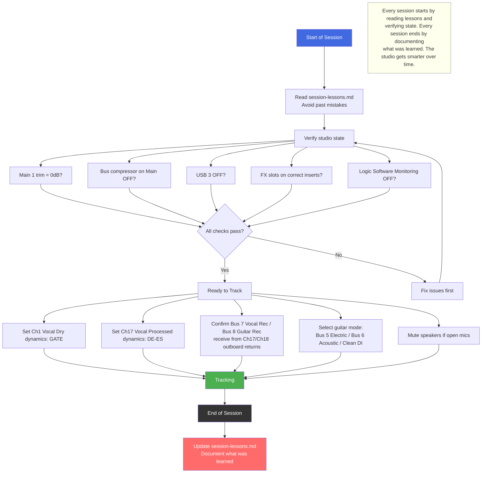
```mermaid
flowchart TD
    START[Start of Session] --> READ[Read session-lessons.md<br/>Avoid past mistakes]
    READ --> VERIFY[Verify studio state]

    VERIFY --> V1[Main 1 trim = 0dB?]
    VERIFY --> V2[Bus compressor on Main OFF?]
    VERIFY --> V3[USB 3 OFF?]
    VERIFY --> V4[FX slots on correct inserts?]
    VERIFY --> V5[Logic Software Monitoring OFF?]

    V1 --> READY{All checks pass?}
    V2 --> READY
    V3 --> READY
    V4 --> READY
    V5 --> READY

    READY -->|Yes| TRACK[Ready to Track]
    READY -->|No| FIX[Fix issues first]
    FIX --> VERIFY

    TRACK --> T1[Set Ch1 Vocal Dry dynamics: GATE]
    TRACK --> T2[Set Ch17 Vocal Processed dynamics: DE-ES]
    TRACK --> T3[Confirm Bus 7 Vocal Rec / Bus 8 Guitar Rec<br/>receive from Ch17/Ch18 outboard returns]
    TRACK --> T4[Select guitar mode:<br/>Bus 5 Electric / Bus 6 Acoustic / Clean DI]
    TRACK --> T5[Mute speakers if open mics]

    T1 --> GO[Tracking]
    T2 --> GO
    T3 --> GO
    T4 --> GO
    T5 --> GO

    GO --> END_SESSION[End of Session]
    END_SESSION --> UPDATE[Update session-lessons.md<br/>Document what was learned]

    NOTE[Every session starts by reading lessons and<br/>verifying state. Every session ends by documenting<br/>what was learned. The studio gets smarter over time.]

    style NOTE fill:#ffe,stroke:#999
    style START fill:#4169E1,color:#fff
    style GO fill:#4CAF50,color:#fff
    style END_SESSION fill:#333,color:#fff
    style UPDATE fill:#FF6B6B,color:#fff
```

---

## Architecture Evolution

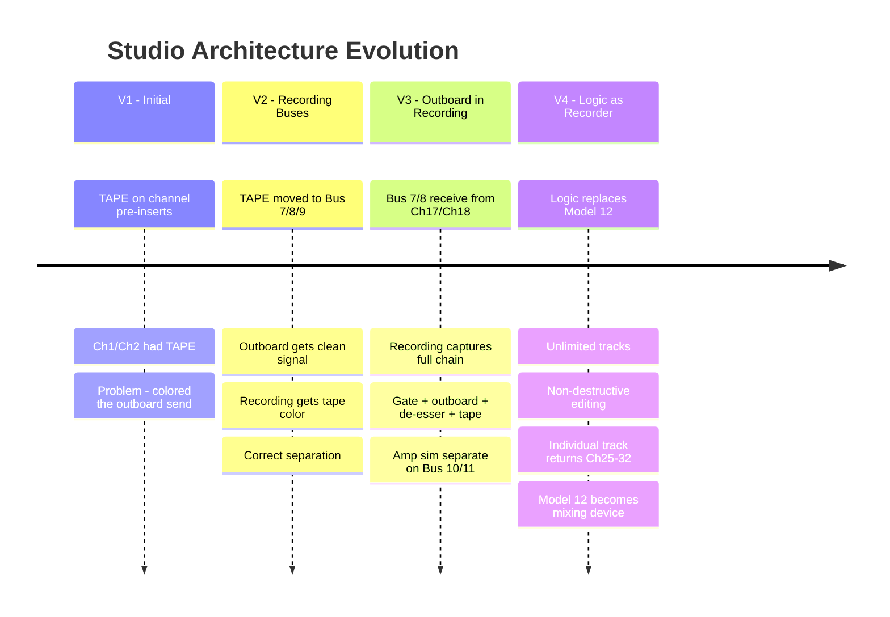
```mermaid
timeline
    title Studio Architecture Evolution
    section V1 - Initial
        TAPE on channel pre-inserts : Ch1/Ch2 had TAPE
        : Problem - colored the outboard send
    section V2 - Recording Buses
        TAPE moved to Bus 7/8/9 : Outboard gets clean signal
        : Recording gets tape color
        : Correct separation
    section V3 - Outboard in Recording
        Bus 7/8 receive from Ch17/Ch18 : Recording captures full chain
        : Gate + outboard + de-esser + tape
        : Amp sim separate on Bus 10/11
    section V4 - Logic as Recorder
        Logic replaces Model 12 : Unlimited tracks
        : Non-destructive editing
        : Individual track returns Ch25-32
        : Model 12 becomes mixing device
```

---

## Gain Staging Reference

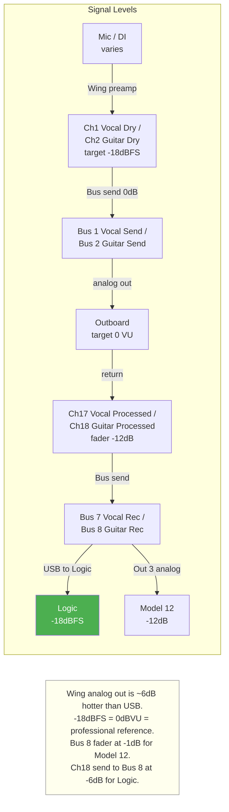
```mermaid
graph LR
    subgraph Signal Levels
        MIC[Mic / DI<br/>varies] -->|Wing preamp| CH[Ch1 Vocal Dry /<br/>Ch2 Guitar Dry<br/>target -18dBFS] -->|Bus send 0dB| BUS_OUT[Bus 1 Vocal Send /<br/>Bus 2 Guitar Send] -->|analog out| OB[Outboard<br/>target 0 VU]
        OB -->|return| CH_PROC[Ch17 Vocal Processed /<br/>Ch18 Guitar Processed<br/>fader -12dB] -->|Bus send| REC_BUS[Bus 7 Vocal Rec /<br/>Bus 8 Guitar Rec]
        REC_BUS -->|USB to Logic| LOGIC[Logic<br/>-18dBFS]
        REC_BUS -->|Out 3 analog| M12[Model 12<br/>-12dB]
    end

    NOTE[Wing analog out is ~6dB hotter than USB.<br/>-18dBFS = 0dBVU = professional reference.<br/>Bus 8 fader at -1dB for Model 12.<br/>Ch18 send to Bus 8 at -6dB for Logic.]

    style NOTE fill:#ffe,stroke:#999
    style LOGIC fill:#4CAF50,color:#fff
```

---

## Monitoring Matrix - What You Hear

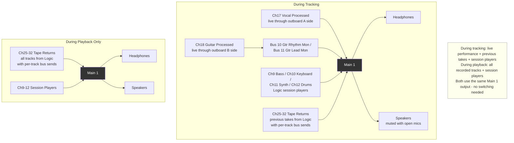
```mermaid
graph TD
    subgraph During Tracking
        LIVE_V[Ch17 Vocal Processed<br/>live through outboard A side] --> MAIN
        LIVE_G[Ch18 Guitar Processed<br/>live through outboard B side] --> BUS10_11[Bus 10 Gtr Rhythm Mon /<br/>Bus 11 Gtr Lead Mon] --> MAIN
        SP[Ch9 Bass / Ch10 Keyboard /<br/>Ch11 Synth / Ch12 Drums<br/>Logic session players] --> MAIN
        TR_TRACK[Ch25-32 Tape Returns<br/>previous takes from Logic<br/>with per-track bus sends] --> MAIN
        MAIN[Main 1] --> HP[Headphones]
        MAIN --> SPK[Speakers<br/>muted with open mics]
    end

    subgraph During Playback Only
        TR_PLAY[Ch25-32 Tape Returns<br/>all tracks from Logic<br/>with per-track bus sends] --> MAIN2[Main 1]
        SP2[Ch9-12 Session Players] --> MAIN2
        MAIN2 --> HP2[Headphones]
        MAIN2 --> SPK2[Speakers]
    end

    NOTE[During tracking: live performance + previous takes + session players<br/>During playback: all recorded tracks + session players<br/>Both use the same Main 1 output - no switching needed]

    style MAIN fill:#333,color:#fff
    style MAIN2 fill:#333,color:#fff
    style NOTE fill:#ffe,stroke:#999
```

---

## Outboard Chain Detail

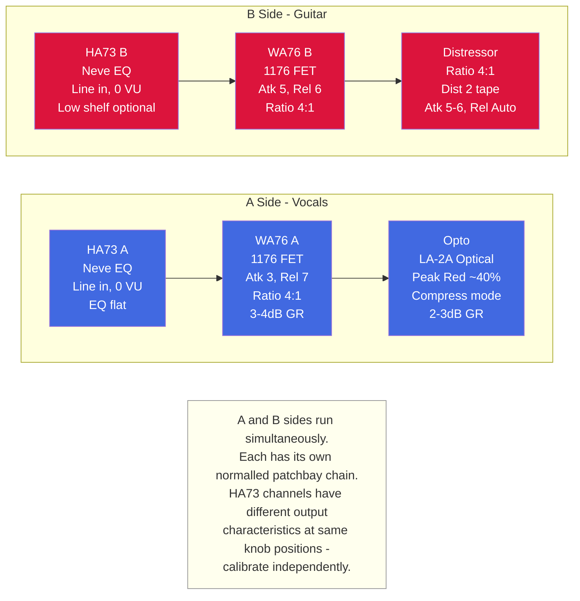
```mermaid
graph LR
    subgraph A Side - Vocals
        direction LR
        HA73A[HA73 A<br/>Neve EQ<br/>Line in, 0 VU<br/>EQ flat] --> WA76A[WA76 A<br/>1176 FET<br/>Atk 3, Rel 7<br/>Ratio 4:1<br/>3-4dB GR] --> OPTO[Opto<br/>LA-2A Optical<br/>Peak Red ~40%<br/>Compress mode<br/>2-3dB GR]
    end

    subgraph B Side - Guitar
        direction LR
        HA73B[HA73 B<br/>Neve EQ<br/>Line in, 0 VU<br/>Low shelf optional] --> WA76B[WA76 B<br/>1176 FET<br/>Atk 5, Rel 6<br/>Ratio 4:1] --> DIST[Distressor<br/>Ratio 4:1<br/>Dist 2 tape<br/>Atk 5-6, Rel Auto]
    end

    NOTE[A and B sides run simultaneously.<br/>Each has its own normalled patchbay chain.<br/>HA73 channels have different output<br/>characteristics at same knob positions -<br/>calibrate independently.]

    style HA73A fill:#4169E1,color:#fff
    style WA76A fill:#4169E1,color:#fff
    style OPTO fill:#4169E1,color:#fff
    style HA73B fill:#DC143C,color:#fff
    style WA76B fill:#DC143C,color:#fff
    style DIST fill:#DC143C,color:#fff
    style NOTE fill:#ffe,stroke:#999
```
